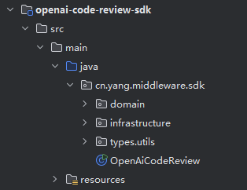

# openai review code

## 中间件介绍
这是一个基于人工智能的代码评审工具，主要利用智谱AI的ChatGLM大语言模型对代码提交进行自动化评审。该工具能够分析Git代码差异，提供专业的代码质量评估和改进建议，并通过邮件通知相关开发人员。

[点击查看效果](https://github.com/tinkerbellqwq/openai-code-review-log/blob/main/2025-05-17/openai-code-review-master-tinker%20%3C1539214893%40qq.com%3E1747457662474-PIja.md)

## 项目的结构：

该项目采用了领域驱动设计(DDD)的架构思想，清晰地分为以下几个层次：

应用层：`OpenAiCodeReview` 类作为主入口，负责初始化各种服务和启动代码评审流程。

领域层：

`domain.service` 包含代码评审的核心业务逻辑

`domain.model` 定义了业务模型和实体

基础设施层：

`infrastructure.git` 提供Git操作相关功能

`infrastructure.openai` 封装了与ChatGLM API的交互 

`infrastructure.mail` 实现了邮件发送功能

## 核心功能

**代码差异获取**：通过JGit库获取最新提交的代码差异。

**AI代码评审**：将代码差异发送给ChatGLM进行分析，获取专业的代码评审结果，包括：
代码评分（0-100分）
代码逻辑与目的分析
代码优点
问题点识别（性能瓶颈、逻辑缺陷、安全风险等）
具体的优化修改建议
修改后的代码示例

**评审结果记录**：将评审结果提交到指定的GitHub仓库，便于团队查阅和追踪。
邮件通知：将代码评审结果通过邮件发送给相关开发人员，支持HTML格式的Markdown渲染。

## 技术栈

编程语言：`Java 8`

构建工具：`Maven`

核心依赖：

`Spring Boot 2.7.12`（测试模块）

`JGit 5.13.0`（Git操作）

`ChatGLM API`（AI模型接口）

`JavaMail 1.6.2`（邮件功能）

`Fastjson 2.0.49`（JSON处理）

`Guava 32.1.3`（工具库）